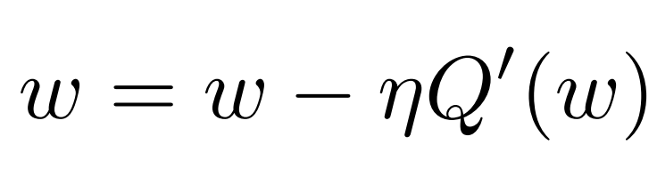
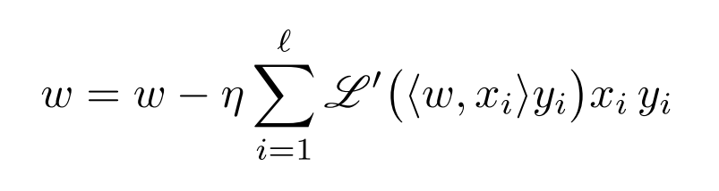
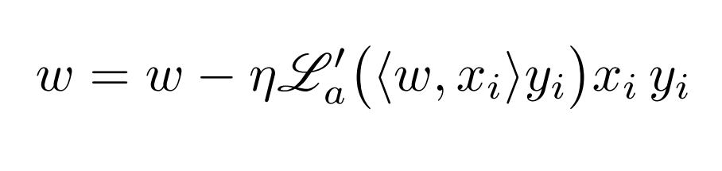

# ML1

Это репозиторий с алгоритмами машинного обучения

## Оглавление
0. [Метрические алгоритмы](#Метрические-алгоритмы)
    1. [Алгоритм ближайших соседей](#Алгоритм-ближайших-соседей)
    2. [Метод парзеновского окна](#Метод-парзеновского-окна)
    3. [Метод потенциальных функций](#Метод-потенциальных-функций)
    4. [Отбор эталонных объектов](#Отбор-эталонных-объектов)
    5. [Сравнение метрических алгоритмов](#Сравнение-метрических-алгоритмов)
1. [Байесовские алгоритмы классификации](#Байесовские-алгоритмы-классификации)
    1. [Линии уровня нормального распределения](#Линии-уровня-нормального-распределения)
    2. [Нормальный наивный байесовский классификатор](#Нормальный-наивный-байесовский-классификатор)
    3. [PlugIn алгоритм](#PlugIn-алгоритм)
    4. [LDF алгоритм](#LDF-алгоритм)
2. [Линейные алгоритмы классификации](#Линейные-алгоритмы-классификации)
    1. [ADALINE, Правило Хебба](#ADALINE,-Правило-Хебба)
    2. [Метод опорных векторов](#Метод-опорных-векторов)
    
## Метрические алгоритмы
[:arrow_up:Оглавление](#Оглавление)

### Алгоритм ближайших соседей
Алгоритм ближайших соседей далее будет называться ***kNN***(k-nearest-neighbourhoods).
Для иллюстрации примеров используем выборку цветков ириса Фишера разбитую по классам(цветам).

```R

simpl_kNN <- function(x) {
  #получает data.frame с ирисами Фишера
  #и считает кокого класса оказалось больше
  
  tmp <- table(x$Species)
  return(names(which.max(tmp)))
}

kNN <- function(x, y, k = NA, q = NA, mode = simpl_kNN, rall = FALSE) {
  #основная функция kNN
  #x - классифицируемый объект
  #y - классифицирующая выборка
  #k - параметр колличества ближайших сосеодей
  #q - параметр для kwNN. Если задан, то алгоритм kNN будет отрабатывать как kwNN
  #mode - как учитывать соседей
  #rall - параметр на случай, если нужно просто вернуть список ближайших соседей

  #сортировка соседей по расстоянию
  orderY <- distanses(x, y)
  
  #вернуть список соседей, если требуется
  if(rall) {
    return(orderY)
  }
  
  #ответ
  res <- 0
  
  #условие, проверяющее отбработать как kNN или kwNN
  if(is.na(q) && !is.na(k) ) {
    
    #не задан q, но задан k -> kNN
    res <- simpl_kNN(orderY[1:k, ])

  } else if(!is.na(q) && is.na(k)) {
    
    
    #задан q, но не задан k -> kwNN, и передать всю выборку
    res <- kwNN(orderY, q)

  } else if(!is.na(q) && !is.na(k)) {
  
    #задан q и задан k -> kwNN, и передать часть выборки
    res <- kwNN(orderY[1:k, ], q)
    
  }

  return(res)
}
```


**kNN** для каждого поступающего объёкта на классификацию берёт ***k*** ближайших соседей, и тот класс(цвет), которого оказалось больше, и будет ответом ***kNN***.
Например вот карта классификации при ***k = 5***. 


Понятно, что разные ***k*** будут давать разную точность классификации, и алгоритм подбора лучшего ***k*** называется алгоритмом скользящего контроля. Один из них ***LOO***(Leave-one-out).


После приминения ***LOO*** на выборке ирисов Фишера обнаружилось несколько лучших ***k*** равных ***7*** и ***26***.


В методе ***kNN*** все соседи, в общем случае, равноправны, однако вполне возможно ввести весовую функцию такую, что чем дальше сосед по порядку близости, тем менее он важен.
Сам метода называется методом взвешенных ближайших соседей или ***kwNN***. Т.е. вес у каждого соседа будет 
, где *i* - номер соседа по порядку.


Конечно для ***kwNN*** также возможно использовать ***LOO***, для нахождения лучшего ***k*** и ***q***. Можно по отдельности или, для лучшего результата, искать их одновременно.

```R
#функция подсчёта соседей методом kwNN
kwNN <- function(x, q = 0.7) {
  #x - поступающая выборка
  #q - параметр меньший единицы для учёта соседей
  
  #переменная хранящая влияние классов
  cnt <- c(0, 0, 0)
  names(cnt) <- names(table(x$Species))
  l <- dim(x)[1]
  
  for (i in 1:l) {
    
    #добавить к влиянию класса i-того елемента x
    #параметр q в зависимости от порядка по дальности елемента x
    #от целевого объекта классификации
    cnt[x$Species[i]] <- cnt[x$Species[i]] + q ^ (i - 1)
  }
  
  #вернуть имя класса с максимальным влиянием
  return(names(which.max(cnt)))
}
```


***kwNN***, по сравнению с ***kNN***, лучше работает в некоторых выборках. Например где колличество объектов одного из классов меньше чем ***k***.  


[:arrow_up:Оглавление](#Оглавление)

### Метод парзеновского окна
***Метод парзеновского окна*** отличается от ***kNN*** и ***kwNN*** тем, что учитывает только тех соседей, которые попадают в определённый промежуток, который называется *окном*.
Причём вклад каждого объекта попавшего в *окно* вычисляет специальная функция называющаяся *ядро* или *kernel*.

У ширины *окна* есть некоторые особенности:
1. Если взять слишком большое, то ответ классификатора может выродится в константу, т.е. всегда давать один и тот же ответ.
2. Если взять слишком маленькое, то классификатор будет неустойчив и объекты которые ему принадлежат просто будут считаться неопределёнными.

Если выбирать среди *ядер*, то нужно отталкиваться от выборки. Например в ирисах Фишера выбор *ядра* не столь критично сказывается на качестве классификации, однако если выбирать *ядро* по типу *прямоугольного*, то появятся объекты, чей тип неопределён.
 


Конечно к ***парзеновскому окну*** так же применим LOO для поиска лучшей ширины *окна* ***h***. Однако необходимо не забывать особенности *окна* упомянутые выше.
Лучшее значение ***h = 0.31***  по версии ***LOO*** .


Сравнивая по точности ***парзеновское окно*** вместе с ***kNN*** и ***kwNN*** на выборке ирисов Фишера особой разницы не заметно, так как применяя LOO достигается одинаковая точность классификации. Однако ***парзеновское окно*** имеет смысл использовать, если ваши данные, например, кластерезированы и сильно удалены друг от друга, или вы хотите, чтобы не все поступающие объекты были классифицированы и некоторые считались выбросами и шумами.

```R
#возвращает результат квадратного ядра
kernel_square <- function(p, h) {

  #p - расстояние между двумя объектами
  #h - окно
  
  ans <- 0
  
  if(p/h <= 1) {
    ans <- 0.5
  }
  
  return(ans)
}

#возвращает результат треугольного ядра
kernel_triangle  <- function(p, h) {

  #p - расстояние между двумя объектами
  #h - окно
  
  ans <- max(0, 1 - p/h)
 
  return(ans)
}

#возвращает результат гаусовского ядра
kernel_gaus <- function(p, h) {

  #p - расстояние между двумя объектами
  #h - окно
  
  ans <- (1 / (sqrt(2 * pi))) * (exp(-((p/h) * (p/h)) / 2)) 
  
  return(ans)
}

#функция проверки объектов выборки на попадание в окно
#и учёта попавших при помощи ядра
check_window <- function(x, y, h, param = NA, kernel = kernel_square) {

  #x - классифицируемый объект
  #y - классифицирующая выборка
  #h - окно
  #param - параметры data.frame, по которым будет идти классификация
  #kernel - ядро
  
  #переменная хранит влияния классов
  cnt <- integer(3)
  names(cnt) <- names(table(y$Species))
  
  i = 1;
  l = dim(y)[1]
  
  #выставить классифицирующие параметры по умолчанию
  if(is.na(param)) {
    param <- c(3:4)
  }
  
  #цикл проверки
  while (i <= l) {
    tmp <- euclid(x[param], y[i, param])
    
    cnt[y$Species[i]] <- cnt[y$Species[i]] + kernel(tmp, h)
    
    i <- i + 1
  }
  
  
  #если ни один елемент не попал внутрь окна
  #то объект считать не классифицируемым
  if(sum(cnt) == 0) {
    return("na")
  }
  
  #имя класса с максимальным влиянием
  return(names(which.max(cnt)))
}


#основная функция парзеновского окна
parsewindow <- function(x, y, h,
                        param = NA, rall = FALSE, kernel = kernel_square) {
                        
  #x - классифицируемый объект
  #y - классифицирующая выборка
  #h - окно
  #param - параметры data.frame, по которым будет идти классификация
  #rall - TRUE, если нужно вернуть data.frame ближайших соседей
  #kernel - ядро
           
  ordY <- distanses(x, y)
  
  if(rall) {
    return(ordY)
  }
  
  if(is.na(param)) {
    param <- c(3:4)
  }
  
  return(check_window(x, ordY, h, param = param, kernel = kernel))
}
```

[:arrow_up:Оглавление](#Оглавление)

### Метод потенциальных функций 
***Метод потенциальных функций*** продолжает идею ***парзеновского окна*** с одним отличием: каждый елемент имеет свою силу влияния - *потенциал*. Получается, что тот результат, который нам вернёт *ядро* будет учтено вместе с *потенциалом* объекта(например умножать потенциал на ядро). *Потенциал* объекта выборки находится путём его повыешния до тех пор, пока объект не станет классифицироваться правильно.


```R
#основная функция метода потенциальных функций
potfuc <- function(y, h = best_h, kernel = kernel_square) {
   
  #y - обучающая выборк
  #h - окно
  #kernel - ядро
  
  l = dim(y)[1]
  
  #используется в выводе графика работы метода
  results <- 1
  
  #будет хранить ошибку на шаге
  #изначально считаем ошибку равной 100%
  miss = 1
  
  #предыдущая ошибка на шаге
  #используется, чтобы остановить алгоритм
  #если ошибка не улучшается
  pmiss = 1
  
  #считает шаги, сколько ошибка не улучшается
  cnt = 0
  
  #цикл подсчёта потенциалов
  #остановить если ошибка 3 раза не уменьшилась
  while(cnt < 3) {
    
    #сранвение не улучшения ошибки
    #вычитание с учётом окрестности, так как работаем с не целыми числами
    if(miss - pmiss < 1e-6) {
      cnt <- cnt + 1
    } else {
      cnt = 0
    }
    pmiss = miss
    
    miss = 1
    
    for (i in 1:l) {
      d <- y[i, ]
      tclass <- parsewindow(d, y, best_h, kernel = kernel)
      
      #если классифицировали объект не правильно
      #
      if(tclass != d$Species) {
        y$potenc[i] <- y$potenc[i] + 1
      } else {
        miss <- miss - 1/150
      }
    }
    results <- c(results, miss)
  }
  
  #вывод график ошибок
  plot(results, type = 'l', xlab = "step", ylab = "miss")
  return(y)
}
```
[:arrow_up:Оглавление](#Оглавление)

### Отбор эталонных объектов

Логично предположить, что возможна ситуация в которой не все объекты выборки важны для классификации и некоторые из них можно убрать, чтобы повысить скорость классификации. Часто также повышается качество классификации.

Понимать то, насколько важен объект, будем характеристикой *отступа*(***margin***) объекта. *Отступ* - это величина считающаяся для каждого объекта из выборки отдельно, получившаяся в результате разницы между всеми объектами своего класса и колличеством объектов другого класса, которых больше всего.


```R

# считает отступ для класса методом kNN
simpl_marg_knn <- function(x, class_name) {
  tmp <- table(x$Species)
  z = tmp[names(tmp) != class_name]
  return( tmp[class_name] - z[which.max(z)] )
}

# промежуточная функция для подсчёта отступа
# ради упрощения интерфейса
marg_knn <- function(x, y, k, chk_fst = FALSE) {
  ordY <- distanses(x, y)
  
  # print(x)
  # print(ordY[1,])
  
  #важное условие, которе будет проверять,
  #что проверяемый объект уже не находится в списках
  #эталонов
  if(chk_fst && prod(x[1, ] == ordY[1, ])) {
    return("kek")
  }
  return(simpl_marg_knn(ordY[1:k, ], x$Species))
}
```

При помощи двух указанных выше функций отступы для всех объектов выборки сохранятся в переменной ***margins*** и самые большые отступы для каждого класса сохранятся в переменной ***s***, также вся выбока с исключёнными шумовыми(у которых *отступ* меньше нуля) будет хранится в переменной ***after_stolp***.

```R
#цикл, который к эталонам добавит объекты такие,
#что их отступ на выборке из имеющихся эталонов меньше едницы
while(length(s[,1]) < length(after_STOLP[,1])) {
  #цикл будет идти либо пока больше не останется отступов меньше единицы
  #либо пока мы не добавим все имеющиеся объекты к эталонам
  
  #переменная считает колличество полученных не положительных отступов
  cnt <- 0
  l = dim(after_STOLP)[1]
  
  #переменная, хранящая минимальный полученный отступ за 1 проход цикла
  minm <- 10000
  #переменная, хранящая индекс объекта с минимальным отступом
  xi = 1
  
  #вложенный цикл проверки отступов всех объектов
  for(i in 1:l) {
    p <- after_STOLP[i, ]
    
    #запомнить отступ
    pmarg <- marg_knn(p, s, min(length(s), 7), chk_fst = TRUE)
    print(pmarg)
    
    #если объект меньше единицы, то засчитываем его только тогда,
    #когда он не является эталоном 
    if(pmarg != "kek" && pmarg < 1) {
      cnt <- cnt + 1
    } 
    
    if(pmarg != "kek" && pmarg < minm) {
      minm <- pmarg
      xi = i
    }
  }
  
  #условие на остановку цикла
  if(cnt < 1 && length(s[,1]) > 7) {
   break 
  }
  
  s <- rbind(s, after_STOLP[xi, ])
}
```


[:arrow_up:Оглавление](#Оглавление)

### Сравнение метрических алгоритмов
Выборка: ирисы Фишера.
|Алгоритм|Спецификаторы|Точность на выбоке|За сколько классифицируется 150 элементов|
|--------|-------------|:------:|:----------:|
|kNN|k=7| 145\150 (0.966)| 21.54902 c.|
|kwNN|k=7, q = 0.01| 148\150 (0,986)| 31,651965 c.|
|Парзеновское окно|h = 0.31, ядро = квадратное| 144/150 (0.96)| 45.17914 c.|
|Потенциальные функции| h = 0.31, ядро = квадратное| 137/150 (0,913) | 42.30456 c.|
|kNN + Отбор эталонов| k = 7| 144/150 (0.96) | 2.833879 c.|


[:arrow_up:Оглавление](#Оглавление)

## Байесовские алгоритмы классификации

Байесовские алгоритмы классификации опираются на теоремму о том, что если плотности распределения классов известны, то алгоритм классификации, имеющий минимальную вероятность ошибок, можно выписать в явном виде.

[:arrow_up:Оглавление](#Оглавление)

### Линии уровня нормального распределения	

Нормальный дискриминантный анализ — это специальный случай баесовской классификации, когда предполагается, что плотности всех классов являются многомерными нормальными. В этом случае задача оценивания параметров распределения по выборке решается аналитически.

Т.е. *n-мерное нормальное(гаусовское) распределение* будет иметь плотность


Соответственно можно изобразить *линии уровня нормального распределения*.


```R
#считает плотность вероятностного распределения для точки
calc_prob_rasp <- function(x, mu, E) {
  for_exp <- (t(x - mu) %*% solve(E) %*% (x - mu)) / (-2)
  nominator <- exp(for_exp)
  
  for_sqrt <- (2 * pi) ^ dim(E)[1] * det(E)
  denominator <- sqrt(for_sqrt)
  
  ans <- nominator / denominator
  return(ans)
}

#отрисовка линий уровня двумерной нормальной плотности распределения
draw_norm_lines <- function(mu, E) {
  #mu - математичское ожидание
  #E - матрица ковариации
  
  #хранит плотности распределения точек
  prob_disp <- data.frame()
  
  #границы
  l <- mu[1, 1] - 3 #левая граница
  r <- mu[1, 1] + 3 #правая граница
  t <- mu[2, 1] + 3 #верхняя граница
  b <- mu[2, 1] - 3 #нижняя граница
  
  for (i in seq(l, r, 0.1)) {
    for(j in seq(b, t, 0.1)) {
      x <- matrix(c(i, j), nrow = 2, ncol = 1)
      
      prob_rasp <- calc_prob_rasp(x, mu, E)
      
      prob_disp <- rbind(prob_disp, c(i, j, prob_rasp))
    }
  }
  
  tt <- prob_disp[order(prob_disp[,1], prob_disp[,2]),]
  
  names(tt) <- c("x", "y", "thic")
  
  contourplot(thic ~ x * y, data = tt, region = TRUE)
  
}
```
[:arrow_up:Оглавление](#Оглавление)

### Нормальный наивный байесовский классификатор

Если все признаки нормально распределены и независимы, то будем использовать оптимальное байесовское решающее правило для наивного байесовского классификатора


А частичную плотность будем считать по формуле


Пример:


```R
#основной алгоритм наивного байеса.
naive_bias <- function(x, y, tlyambda = NA, tmu = NA, ttsigma = NA, taprior = NA) {
  #x - объект для классификации
  #y - выборка
  #tmu - матожиданий предоставленные пользователем.
  #ttsigma - сигмы предоставленные пользователем 
  #taprior - априорные вероятности предоставленные пользователем
  
  mu <- NA #мат ожидания
  tsigma <- NA #сигмы
  aprior <- NA #априорные вероятности
  lyambda <- NA #переменные штрафа за ошибку
  # print("ALAHAMORA")
  lvls <- levels(iris$Species)
  
  #условия проверяющие дал ли пользователь какие-нибудь начальные данные
  #если не дал, то высчитать самостоятельно
  if(is.na(tmu) == FALSE) {
    mu <- tmu
  } else {
    mu <- calc_mu(y)
  }
  
  if(is.na(ttsigma) == FALSE) {
    tsigma <- ttsigma 
  } else {
    tsigma <- calc_sigma(y)
  }
  
  if(is.na(taprior) == FALSE) {
    aprior <- taprior
  } else {
    aprior <- calc_aprior_prob(y)
  }
  
  #использовать датафрейм мат ожиданий, чтобы посчитать колличество классов
  l <- dim(mu)[1]
  
  if (is.na(tlyambda) == FALSE) {
    lyambda <- tlyambda
  } else {
    lyambda <- seq(1, l)
  }
  
  
  maxv <- -1 #начальный максимальный результат
  best_class <- aprior[1,2] #счтитаем клссом по умолчанию первый класс
  
  
  
  for (i in 1:l) {
    tclass <- aprior[i,2]
    aprior_part <- log(lyambda[i] * aprior[i, 1])
    tight_part <- calc_tight(x, tclass, mu, tsigma)
    
    united_part <- aprior_part + tight_part
    
    if(united_part > maxv) {
      maxv <- united_part
      best_class <- tclass
    }
  }
  
  maxv = exp(maxv)
  
  best_class <- lvls[best_class]
  
  ans <- c(best_class, as.numeric(maxv))
  ans <- data.frame(ans[1], maxv)
  names(ans) <- c("class", "tig")
  
  return(ans)
}
```
[:arrow_up:Оглавление](#Оглавление)

### PlugIn алгоритм
Оценим ковариационную матрицу и вектор мат ожиданий
.
Полученные оценки подставим в оптимальный байесовский классификатор и получим PlugIn алгоритм. Собственоо поэтому он и называется "подстановочным".


Код очень похож на наивный нормальный байесовский классификатор собственно потому, как нбк является подвидом PlugIn.
```R
#посчитать плотность в точке
#возвращает double
calc_prob_rasp <- function(x, mu, E) {
  #x - точка как вектор
  #mu - мат ожидание как вектор
  #E - ковариационная матрица
  #(код функции сокращён)
}


#возвращает датафрейм с мат. ожиданиями
#для всех признаков по всем классам
calc_mu <- function (features) {
  #features - датафрейм: вектора признаков - фактор классов
  #(код функции сокращён)
}

#возвращает ковариационную матрицу по признакам
#и мат ожиданию класса
calc_cov_matr <- function(features, mu) {
  #features - датафрейм признаков где последний столбец класс
  #mu - мат ожидание, однострочная матрица
  #(код функции сокращён)
}


#Считает априорные вероятности классов
calc_aprior_prob <- function(features) {
  #features - data.frame с выборкой по которой классифицирутся
  #(код функции сокращён)
}


#основная функция PlugIn алгоритма
#возвращает датафрейм ответов: класс ~ его плотность для объекта
PlugIn <- function(x, y, tlyambda = NA, tmu = NA, taprior = NA) {
  #x - классифицируемые объекты
  #y - классифицирующая выборка
  
  
  xl <- dim(x)[1] #колличество классифицирующихся объектов
  yl <- dim(y)[1] #колличество объектов выборки
  yc <- dim(y)[2] #колличество столбцов выборкиS
  
  mu <- NA #мат ожидания
  aprior <- NA #априорные вероятности
  lyambda <- NA #переменные штрафа за ошибку
  
  #условия проверяющие дал ли пользователь какие-нибудь начальные данные
  #если не дал, то высчитать самостоятельно
  if(is.na(tmu) == FALSE) {
    mu <- tmu
  } else {
    mu <- calc_mu(y)
  }
  
  if(is.na(taprior) == FALSE) {
    aprior <- taprior
  } else {
    aprior <- calc_aprior_prob(y)
  }
  
  #использовать датафрейм мат ожиданий, чтобы посчитать колличество классов
  l <- dim(mu)[1]
  
  if (is.na(tlyambda) == FALSE) {
    lyambda <- tlyambda
  } else {
    lyambda <- rep(1, l)
  }
  
  names(lyambda) <- levels(y[, yc])
  
  
  ans <- data.frame() #
  
  #цикл классификации
  for (i in 1:xl) {
    x_i <- x[i, ] #взять i-тый елемент для классификации
    
    maxv <- -1e6 #максимальная плонтость
    best_class <- y[1, yc] #класс с максимальной плотностью
    
    #вложенный цикл классифицирующий один объект
    #идёт по классам
    for(j in levels(y[, yc])) {
      same_class <- which(y[, yc] == j) #найти индексы объектов одинакового класса
      yj <- y[same_class, ] #взять объекты одинакового класса из выборки
      
      mu_for_j <- which(mu[, yc] == j)#индекс мат ожидания класса j
      E <- calc_cov_matr(yj, mu[mu_for_j, ]) #посчитать ковариационную матрицу
      
      lyambda_j <- lyambda[j] #взять ошибку для класса j
      for_aprior <- which(aprior[, 2] == j) 
      aprior_j <- aprior[for_aprior, 1] # взять априорную вероятность для класса j
      tig <- calc_prob_rasp(x_i, mu = mu[mu_for_j, 1:yc-1], E = E) #посчитать плотность
      
      tmp_ans <- lyambda_j * aprior_j * tig #вероятный ответ
      
      #проверка лучше ли вероятный ответ чем предыдущий лучший
      if(tmp_ans > maxv) {
        maxv <- tmp_ans
        best_class <- j
      }
    }
    
    best_ans_for_xi <- c(best_class, maxv) 
    ans <- rbind(ans, best_ans_for_xi)
  }
  
  name_class_col <- names(y)[yc]
  names(ans) <- c(name_class_col, "tig")
  return(ans)  
}
```
[:arrow_up:Оглавление](#Оглавление)

### LDF алгоритм
Суть LDF алгоритма в эвристике которая говорит: предполагаем, что все ковариационные матрицы равны - при таком условии мы можем ограничится вычислением только одной ковариацинной матрицы. Тогда вполне можно оценить ковариационную матрицу по всем элементам обучающей выборки. В результате получим некую *среднюю* ковариационную матрицу, которая, в общем случае, повысит устойчивость алгоритма.

LDF строит разделяющую пряму между классами.


```R
#основная функция LDF алгоритма
#возвращает датафрейм ответов: класс ~ его плотность для объекта
LDF <- function(x, y, tlyambda = NA, tmu = NA, taprior = NA) {
  #x - классифицируемые объекты
  #y - классифицирующая выборка
  
  
  xl <- dim(x)[1] #колличество классифицирующихся объектов
  yl <- dim(y)[1] #колличество объектов выборки
  yc <- dim(y)[2] #колличество столбцов выборкиS
  
  mu <- NA #мат ожидания
  aprior <- NA #априорные вероятности
  lyambda <- NA #переменные штрафа за ошибку
  
  #условия проверяющие дал ли пользователь какие-нибудь начальные данные
  #если не дал, то высчитать самостоятельно
  if(is.na(tmu) == FALSE) {
    mu <- tmu
  } else {
    mu <- calc_mu(y)
  }
  
  if(is.na(taprior) == FALSE) {
    aprior <- taprior
  } else {
    aprior <- calc_aprior_prob(y)
  }
  
  #использовать датафрейм мат ожиданий, чтобы посчитать колличество классов
  l <- dim(mu)[1]
  
  if (is.na(tlyambda) == FALSE) {
    lyambda <- tlyambda
  } else {
    lyambda <- rep(1, l)
  }
  
  tmp_class <- y[1, yc]
  all_tmp_class <- which(y[, yc] == tmp_class)
  E <- calc_cov_matr(y, mu, yl)#так как все ковариацинные матрицы равны
  
  names(lyambda) <- levels(y[, yc])
  
  
  ans <- data.frame() #
  
  #цикл классификации
  for (i in 1:xl) {
    x_i <- x[i, ] #взять i-тый елемент для классификации
    
    maxv <- -1e6 #максимальная плонтость
    best_class <- y[1, yc] #класс с максимальной плотностью
    
    #вложенный цикл классифицирующий один объект
    #идёт по классам
    for(j in levels(y[, yc])) {
      same_class <- which(y[, yc] == j) #найти индексы объектов одинакового класса
      yj <- y[same_class, ] #взять объекты одинакового класса из выборки
      
      mu_for_j <- which(mu[, yc] == j)#индекс мат ожидания класса j
      # E <- calc_cov_matr(yj, mu[mu_for_j, ], yl) #посчитать ковариационную матрицу
      
      lyambda_j <- lyambda[j] #взять ошибку для класса j
      for_aprior <- which(aprior[, 2] == j) 
      aprior_j <- aprior[for_aprior, 1] # взять априорную вероятность для класса j
      tig <- calc_prob_rasp(x_i, mu = mu[mu_for_j, 1:yc-1], E = E) #посчитать плотность
      
      tmp_ans <-  log(lyambda_j * aprior_j) + tig #вероятный ответ
      
      #проверка лучше ли вероятный ответ чем предыдущий лучший
      if(tmp_ans > maxv) {
        maxv <- tmp_ans
        best_class <- j
      }
    }
    
    best_ans_for_xi <- c(best_class, as.numeric(maxv)) 
    ans <- rbind(ans, best_ans_for_xi)
  }
  
  name_class_col <- names(y)[yc]
  names(ans) <- c(name_class_col, "tig")
  return(ans)  
}

```
[:arrow_up:Оглавление](#Оглавление)

## Линейные алгоритмы классификации

### ADALINE, Правило Хебба

#### Стохастический градиентный спуск
И так имеем: два класса *-1* и *+1*, обучающую выборку *вектор - ответ*. Будем искать вектор весов такой, при котором мы достигнем *минимизации апроксимированного эмпирического риска*.
<b>


Для поиска лучшего вектора весов применим метод градиентного спуска. Двигаясь в сторону антиградинета мы сделаем шаг в направлении убывания функции.
<b>

<b>


Делать шаг можно также не учитывая всю выборку сразу, а отдельно по каждому преценденту.
<b>


Причём, если выбирать прецендент не по порядку, а случайно, то получим метод *стохастического градиентного спуска*

#### ADALINE

### Метод опорных векторов

Смысл метода заключается в посторении особой разделяющей гиперплоскости. В общем случае, если выборка линейно разделима, то таких разделяющих плотностей будет множество. Идея метода в том, чтобы разумно распорядится этой свободой: выбрать плоскоскость которая максимально удалена от всех точек выборки - такое требование появилось из соображений, что большой "зазор" будет давать более устойчевые решения.

Все подходящие гиперплоскости образуют *полосу* которая ограничивается двумя гиперплоскостями и та гиперплоскость, которая посередине, будет решением. Соответсивенно, чтобы найти гиперплоскость с максимальным *зазором* нужно найти максимальную по ширение полосу разделяющих гиперплоскостей для классов.

Пусть x− и x+ — два обучающих объекта классов −1 и +1 соответственно, лежащие на границе полосы. Тогда ширина полосы есть


Тогда, в случае линейно разделимой выборки получим 


На практике классы редко линейно разделимы, тогда обобщим уравнение добавив штраф за ошибку. 


***С*** константа управляющая компромисом между шириной полосы и точностью классификации.

Построим двойственную задачу. Для этого запишем уравнение Лагранжа для этой системы:


И саму двойственную задачу:


Соответсвенно все объекты выборки можно разделить по отступу на три категории:

    1. Отступ больше либо равен нулю - тогда такие объекты классифицируются правильно и не влияют на классификацию (неинформативные).
    2. Отступ равен единице - такие объекты классифицируются правильно и лежат в точности на границе разделяющей полосы (опорные граничные).
    3. Отступ меньше единицы - такие лежат внутри полосы (опорные нарушители).

Уберая все ненужные переменные которые обнуляются получим задачу:


В итоге алгоритм классификации сводится к:

Порог - это любой вектор из граничных точек.

Ещё один способ классификации, это замена скалярного произведения на функцию Ядра. Таку. функцию можно взять, или построить конструктивно:


И наш алгоритм классификации преобразуется следующим образом:


Можно представить, как двуслойную нейронную сеть:

***Преимущества SVM***

    1. Максимизация *зазора* учулшает обобщающую способность.
    2. Число нейронов определяется автоматически - равно числу опорных векторов.
    3. Если сводится к задаче квадратичного программирования, то имеет одно решение.
    
***Недостатки SVM***

    1. Неустойчивость к шуму. Объекты выброс будут считаться опорными.
    2. Нету общих методов подбора ядер для конкретной задачи.
    3. Подбор параметра ***С*** требует многократного решения задачи.
[:arrow_up:Оглавление](#Оглавление)
